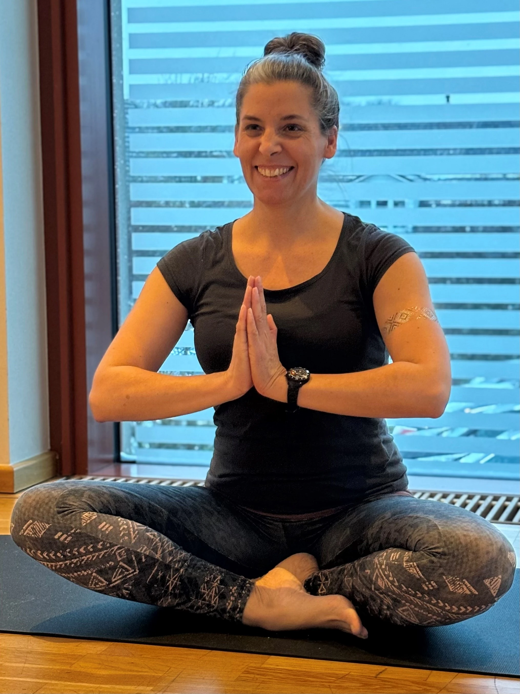
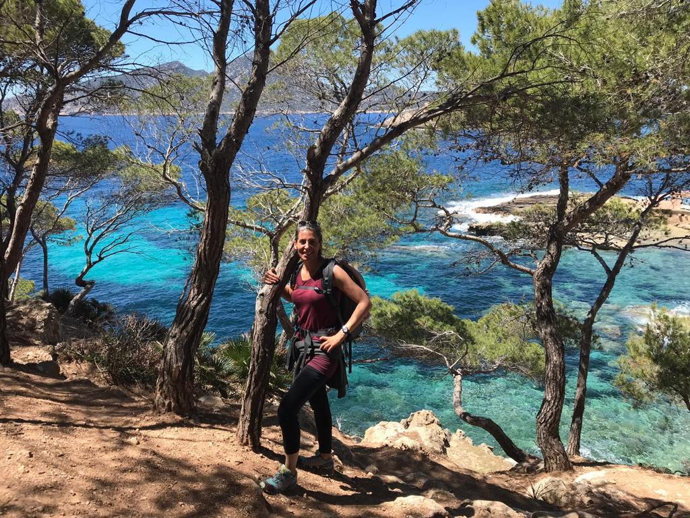

<!-- One -->
<section id="one">
	

		<header class="major">
			<h2>Zu mir</h2>
		</header>
			
 Verena Sass

            
Ich bin 1973 in Hamburg geboren, lebe seit 2000 mit meinem Mann in Nienhagen und bin Mutter von drei wundervollen Kindern. Neben meinem Hauptberuf als Physiotherapeutin und Funktionstrainerin habe ich die Leidenschaft für Yoga entdeckt und habe die 3-jährige Ausbildung als Yogalehrerin erfolgreich abgeschlossen.
 
Melde dich gerne bei Fragen und Anregungen unter yoga.bei.verena@gmail.com oder 05144/560670 bei mir. 

 

<body>
	

    	<!-- Image 1 (replace 'image1.jpg' with the path to your image) -->
    	
	

	

    	<!-- Image 2 (replace 'image2.jpg' with the path to your image) -->
    	
	

</body>
