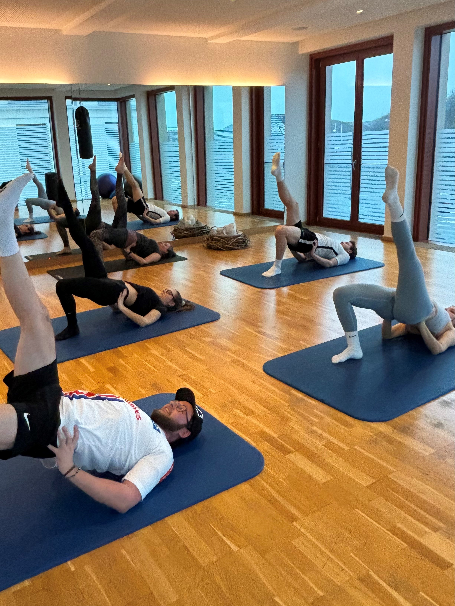
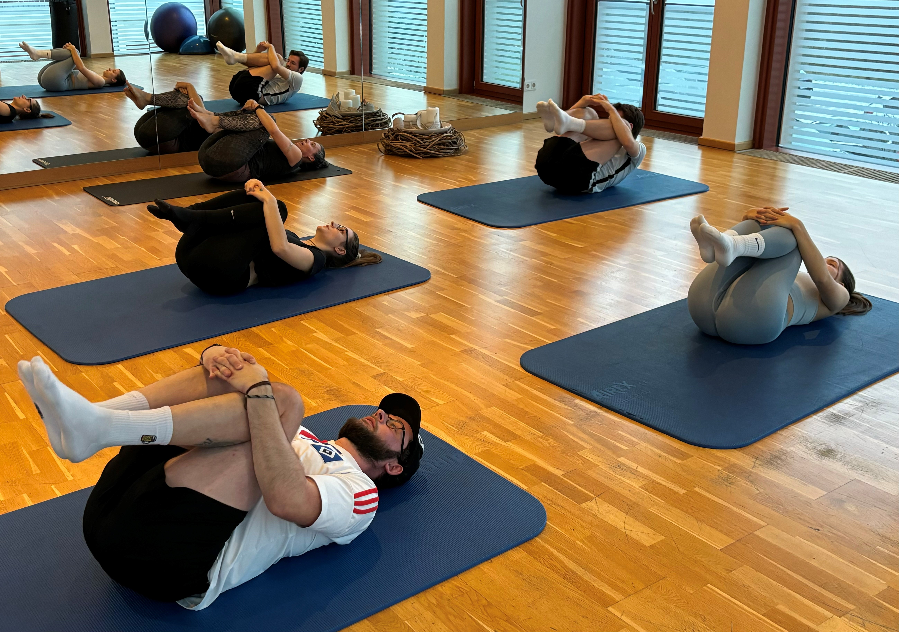

<!-- Main -->

<!-- Add Swiper CSS -->
    <link rel="stylesheet" href="https://unpkg.com/swiper/swiper-bundle.min.css">

 <body>
    

        <!-- First div -->
        

		<header class="major">
            <h2>Yoga für Erwachsene</h2>
		</header>
			
Informationen zu Räumlichkeiten und Zeit folgen in Kürze

Kurs: 10 Einheiten à 75 min. für Euro 150,-

            
Hatha Yoga ist eine Jahrtausende alte Technik, die Körper, Geist und Seele harmonisiert.
			Klassische Yogastellungen (Asanas), sanfte Atemübungen, Entspannungs- und Meditationstechniken  und Wahrnehmungsschulung fördern gleichzeitig Stärke und Flexibilität, schenken Ausgeglichenheit, führen zu mehr Vitalität und schulen die Konzentrationsfähigkeit.
			Die Yogastunden sind für Anfänger und Fortgeschrittene gleichermaßen geeignet. Yoga zu praktizieren bedeutet, sich Zeit für sich zu nehmen. Hier gibt es keinen Leistungsvergleich, jeder Mensch ist einzigartig. Yoga lehrt uns, eins zu sein mit sich, seine Grenzen wahrzunehmen und auszudehnen, auch in der Anspannung zu entspannen. Ganz nach dem Motto: „Alles kann, nichts muss“. Dadurch wird Stress abgebaut, innere Ruhe empfunden, ein klarer Geist entwickelt und frische Energie aufgebaut.
			Nutze diese Möglichkeiten für dich und komme vorbei - ich freue mich auf dich!

			
Der Kurs ist von den Krankenkassen als Präventionskurs zertifiziert und wird dementsprechend bezuschusst.

        

        <!-- Second div -->
        

		<header class="major">
            <h2>Yoga für Teenager</h2>
		</header>
			
Für alle zwischen 13 und 17 Jahren

Kurs: 10 Einheiten à 60 min. für Euro 110,-

            
Yoga tut dem Körper und der Seele gut - in jedem Alter!
			Aber gerade für Teenager kann Yoga eine große Unterstützung sein.
			Denn Yoga ist kein Wettbewerb. Hier geht es nicht darum, sich mit anderen zu vergleichen. Im Yoga geht es ausschließlich um dich selbst.
			Jeder Körper ist einzigartig, auch in seinen Fähigkeiten.
			Durch kräftigende und dehnende Körperübungen wird der gesamte Körper mobilisiert und die Körperaufrichtung gestärkt. Neue Bewegungsmuster sind gut für das Gehirn und fördern den sich im Wachstum befindlichen Körper. Durch Körperwahrnehmung wird das eigene Wohlfühlen und Sorgen für den Körper gefördert.
			Sanfte Atemübungen, Meditation und Entspannung können Stress verringern.
			Yoga kann auch eine prima Ergänzung für andere Sportarten sein, denn es fördert die Fähigkeit zur Konzentration, Fokussierung und Achtsamkeit. Fähigkeiten, die auch im Schulalltag oder bei anderen Herausforderungen eines Teenager-Lebens eine große Hilfe darstellen.
			Yoga bildet also einen Grundstein für ein zufriedenes Leben als selbstbewusster Mensch - und macht dazu noch richtig viel Spaß!
			Neugierig geworden? Dann komm vorbei! 

        

    

<!-- Swiper -->

        

            <!-- Add your images here -->
            

            

            <!-- Add more slides as needed -->
        

        <!-- Add Navigation -->
        

        

    

<!-- Add Swiper JS -->

    <!-- Initialize Swiper -->
    

	
Fragen & Anmeldungen: yoga.bei.verena@gmail.com oder unter 05144/560670

</body>

